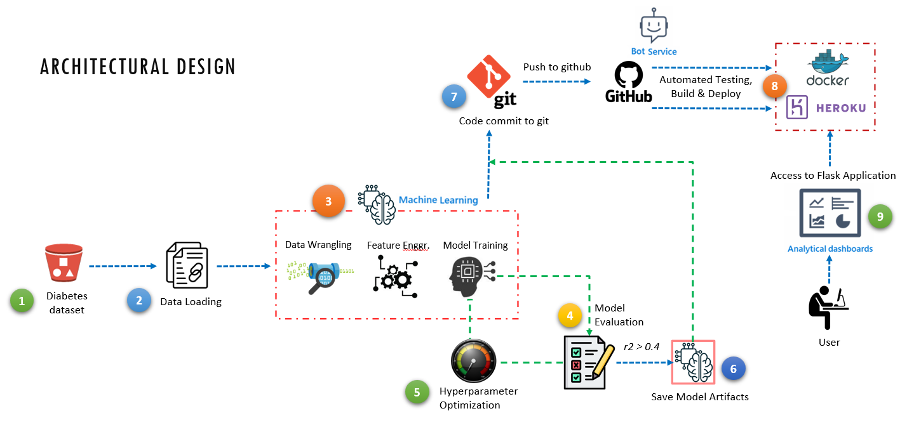

## ML Engineering Challenge

[](https://github.com/nuruzzaman/ml-engineering-demo/actions/workflows/heroku.yml)
[](https://github.com/nuruzzaman/ml-engineering-demo/actions/workflows/docker-publish.yml)
[](https://github.com/nuruzzaman/ml-engineering-demo/actions/workflows/github-code-scanning/codeql)


### Challenge Overview 
The challenge is designed to test a large variety of skills that a machine learning engineer would use in their day to day work. There are no restrictions in terms of technology except Python 3. 

(1) The diabetes dataset was given with 442 patients data and 10 features. However, only one feature was feed into the model and made inference. The task is to fill in the gaps in the `SimpleLinearRegression` class so that the code will run successfully. 

(2) Then, create `app.py` to make it an API for inference. Make the API invokable from a http request. The API should have two endpoints:
- `POST /stream` : which takes a payload of one record and return the prediction for that record.
- `POST /batch` : which takes an array of multiple records and return an array of predictions

(3) Package all codes into a python package and container. Create a simple CICD pipeline and code should be invokable from a public URL. 

(4) Provide a solution document and hight-level architecture-diagram. 

 
### Solution Overview 

The solution works end-to-end from loading diabetes dataset, train the model, predict, save the model, reload it for inference from web browser, build docker image, deploy it on Heroku through CI/CD pipeline. The test solution can be accessible at https://ml-engineering-demo.herokuapp.com/ 

My solution also includes the following: 
- Create model and store model artifacts 
- Hyper-parameter optimization technique 
- Unit tests 
- Capture application logs 
- Create Flask Web App that loads ML model and inferences
- CI/CD Pipeline for automated deployment on Heroku and DockerHub 
- Flexibile intregration with other systems or platforms

Note: as there is only one feature, so data preparation, feature engineering was not implemented. 


### Installation python libraries
First we need to create a virtual environment and install the required python libraries using pip and dependency of the application using following command. 
```
pip install -r requirements -U
```


### Packaging code for installable and testable
You can find the existing installable file in `\dist` folder. However, you can package your code and make another installable file using `pip` and `wheel`. 
```
python setup.py sdist bdist_wheel
```

To upgrade the wheel (if require): 
```
python -m pip install --user --upgrade setuptools wheel  
```

### Packaging into a container and deploy it to a container registry (LOCALLY) 
You can fully dockerize the application and all the services that it depends on. I created `Dockerfile` can be found at root directory. This file contains instructions for building the Docker image. To achieve this, first build a docker image locally:
```
docker build -t ml-engineering-demo:latest .
```

Once the image is built, you can scan Snyk tests to find vulnerabilities using `docker scan`. 

Finally, run the following command to start your application locally.
`docker run -d -p 5000:5000 ml-engineering-demo:latest`

Then the application can be accessible on the host browser at http://localhost:5000 
To stop the container use `docker container stop container_id`

You also can use `docker-compose` for building and running the container, which is more efficient when you have multiple services. You `docker-compose` file at root directory. 
```
docker-compose up -d 
```

### CI/CD pipeline to deploy into Heroku (Prod environment)
I created a workflow in github. when you commit your code it will be automatically tested the code, build and deploy in production environment. The test solution can be accessible at https://ml-engineering-demo.herokuapp.com/ 

There is another automated pipeline for DockerHub as well. You can find docker image at: https://hub.docker.com/r/data2ml/ml-engineering


### High-level architecture diagram of the implementation
 
   
## Key points to remember

### What components an enterprise machine learning system would have? 
An enterprise ML system could have several components, including:
- Data storage and management: for storing and managing large amounts of data, which is used for training, validating, and deploying ML models. This may include data lakes, data warehouses, or other big data storage and management systems.
- Data pre-processing and cleaning pipeline: for preparing and cleaning the data before it is used for training ML models. This includes tasks such as data imputation, data normalization, and data transformation.
- Model development: This is responsible for developing, training, and validating ML models. This may include using various ML libraries and frameworks, such as TensorFlow, PyTorch, scikit-learn, Xgboost etc.
- Model deployment pipeline: for deploying the trained ML models to production environments. This may include using various ML serving platforms, such as TensorFlow Serving, Docker, Kubernetes. 
- Model monitoring and management: for monitoring the performance of deployed ML models, and managing the versioning, rollback, and scaling of models.
- Data governance and security: for ensuring that the data and models are used in a compliant and secure manner. This may include tasks such as data masking, data encryption, role-based access control, and data lineage tracking.
- Model interpretability and explainability: for understanding how the model is making its predictions and the reasons behind them. This may include techniques such as feature importance, partial dependence plots, SHAP values, etc.
- Workflow management: for managing and automating the various stages of the ML pipeline, such as data preparation, model training, model deployment, and monitoring. This may include using workflow management systems, such as Airflow, Prefect, etc.


### What other features an enterprise machine learning system would have? 
An enterprise machine learning (ML) system would have several features, such as:
- Scalability: able to handle large amounts of data and support the training and deployment of multiple ML models. It should also be able to scale up or down as needed to meet the changing demands of the organization.
- Monitoring and management: system should provide monitoring and management capabilities to ensure that ML models are performing well and to manage the versioning, rollback, and scaling of models.
- Explainability: should provide explainability features to help understand how the model is making its predictions and the reasons behind them. 
- Integration: integrate with other systems used by the organization.
- Flexibility: ystem should allow for customization to meet the specific needs of the organization, and allow for integration with different types of data, models, and deployment environments.
- Continuous improvement: by providing the ability to easily update and improve the models, and track the performance over time.
- Cost-efficiency: system should be cost-efficient, by using cloud infrastructure, and providing cost optimization options, such as auto-scaling, auto-shutdown, etc.
- Security and governance: system should provide security and governance features to ensure that data and models are used in a compliant and secure manner. 
- Automation: possible to reduce manual intervention and improve efficiency.  


### What stages requires to implement full CI/CD pipeline? 
Designing a CI/CD pipeline is depending on the organization and the application. A full CI/CD pipeline typically includes several stages, including: 
- Source control management: managing and tracking code changes in a source control system, such as GitHub.
- Build and test: the pipeline automatically builds the code and runs tests to ensure that the code is functional and meets the specified requirements. This may include unit tests, integration tests, and end-to-end tests.
- Static analysis: This involves analyzing the code to identify potential security vulnerabilities, coding style issues, and other problems. This can include linting, code quality analysis, and vulnerability scanning.
- Packaging: creating a package of the code that can be deployed to a target environment. 
- Deployment: the pipeline automatically deploys the packaged code to the target environment. 
- Monitoring and logging: to ensure that it is running correctly and to collect data on its performance. This may include monitoring the application's logs, performance metrics, and error rates.
- Release: involves releasing the code to end-users, which can be achieved through different ways such as blue-green deployment. 


### Time and memory complexity of the code
Time and memory complexity analysis is the process of determining how the running time or memory usage of a program increases as the input size grows. It involves examining the algorithms and data structures used in the code, and determining how they affect the overall performance of the program.

The excerise provided is an implementation of linear regression using stochastic gradient descent (SGD). The class SimpleLinearRegression has fit, predict and input validation methods, and an additional method for optimizing the parameters of the model using GridSearchCV.

- fit: The complexity of the fit function depends on the number of samples and the number of features. 
- predict: 
- params_optimization: depends on the complexity of the estimator used, in this case GradientBoostingRegressor and number of parameters, samples & features and the number of boosting stages. 

### Few suggestions to improve the model 
- Improve the stopping criteria: Instead of running the model for a fixed number of iterations, you can use a convergence criteria such as checking the change in loss or the change in parameters after each iteration.
- Use regularization: Regularization techniques such as L1 or L2 regularization can be used to prevent overfitting.
- Feature scaling: Scale the input features before training the model to ensure that all features are on the same scale. This will improve the performance of the model and make the optimization process faster.
- Add validation set: Use a separate validation set to evaluate the model during training, to prevent overfitting and to select the best model.
- Add more feature: you could add more feature to your data set, so that the model can learn more about the data.
- Implement other regression algorithms. 
